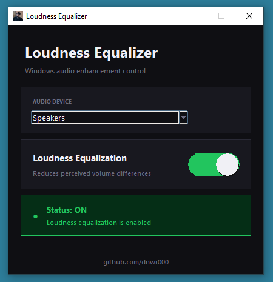

# 🔊 Loudness Equalizer

A simple Windows app to toggle **Loudness Equalization** without going into sound settings every time.

---

## 😤 The Problem

You're watching a movie and everything is fine — then suddenly someone whispers and you can barely hear, so you turn the volume up... and BAM, gunshots or an explosion blasts your ears off. You scramble for the remote, adjust the volume, and it happens again five minutes later.

**Sound familiar?**

Just enable Loudness Equalization with this small app, set a comfortable volume level in Windows, and enjoy watching without constantly reaching for the remote. That's it.

## 📸 Screenshot

---

## ✨ Features

- One-click toggle for Loudness Equalization
- Animated ON/OFF switch — always shows current state
- Select any active audio device from a dropdown
- No installation required — just run the EXE
- Clean dark interface

---

## 📥 Download

Go to the [Releases](../../releases) page and download the latest `Loudness Equalizer.exe`.

---

## 🚀 Usage

1. Run `Loudness Equalizer.exe`
2. Accept the administrator prompt (required to modify audio settings)
3. Select your audio device from the dropdown
4. Click the toggle to enable or disable Loudness Equalization

> **Note:** You may need to restart your audio app after toggling for changes to take effect.

---

## ⚙️ How It Works

Loudness Equalization is a Windows audio enhancement that reduces perceived volume differences. Normally you have to go into **Sound Settings → Properties → Enhancements** to toggle it. This app modifies the Windows registry directly and restarts the audio service to apply the change instantly.

---

## 📋 Requirements

- Windows 10 / 11
- Audio driver that supports Loudness Equalization (most Realtek drivers do)
- Administrator privileges (required to write to registry)

---

## 📄 License

MIT License — see [LICENSE](LICENSE) for details.

---

Made by <a href="https://github.com/dnwr000">@dnwr000</a>

